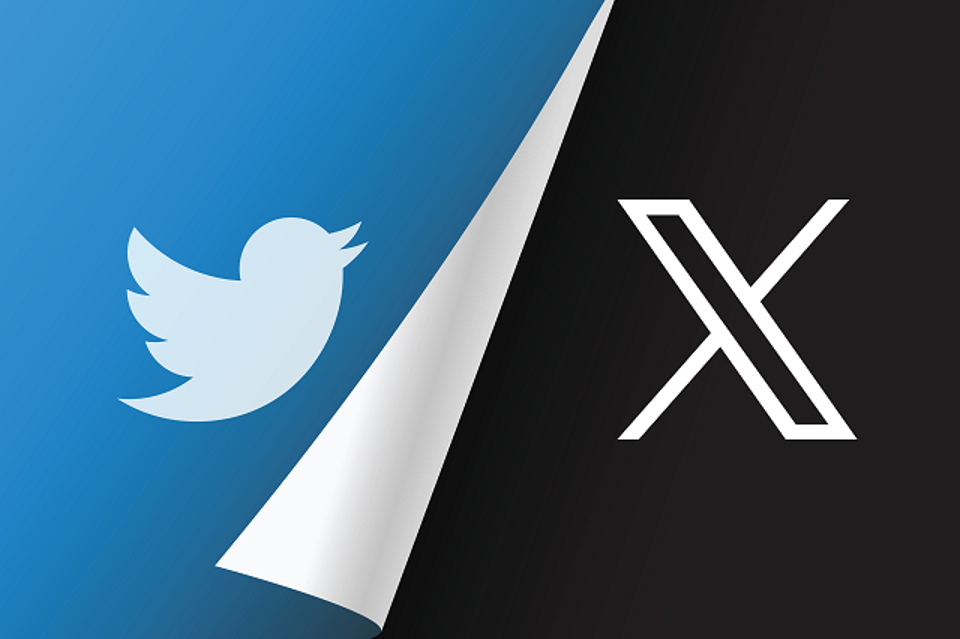

### Daftar Isi
- Rebranding
- Sumber

# Rebranding dari Twitter ke X oleh Elon Musk

Pada 14 April 2022, tokoh bisnis Elon Musk menawarkan untuk membeli perusahaan media sosial Twitter, Inc., dan menyelesaikannya pada tanggal 27 Oktober 2022. Musk mulai membeli saham perusahaan pada Januari 2022, dan menjadi pemegang saham terbesar pada bulan April dengan kepemilikan 9.1 persen. 

Twitter mengundang Musk untuk bergabung dengan dewan direksi, sebuah tawaran yang awalnya ia terima sebelum akhirnya ia tolak. Pada tanggal 14 April, Musk mengajukan tawaran yang tidak diminta untuk membeli perusahaan, yang pada awalnya ditanggapi oleh dewan direksi Twitter dengan menggunakan strategi "pil racun [en]" untuk menolak pengambilalihan yang tidak bersahabat [en] dengan cara memungkinkan pemegang saham membeli saham tambahan jika terjadi pembelian,[1] namun akhirnya dengan suara bulat menerima tawaran pembelian dari Musk sebesar $44 miliar pada tanggal 25 April. 

Musk menyatakan bahwa ia berencana untuk memperkenalkan fitur-fitur baru pada platform ini, membuat algoritmanya menjadi sumber terbuka, memerangi akun-akun spambot, dan mempromosikan kebebasan berbicara.

### Sumber:
[Pengambilalihan Twitter oleh Elon Musk]([https://](https://id.wikipedia.org/wiki/Pengambilalihan_Twitter_oleh_Elon_Musk))